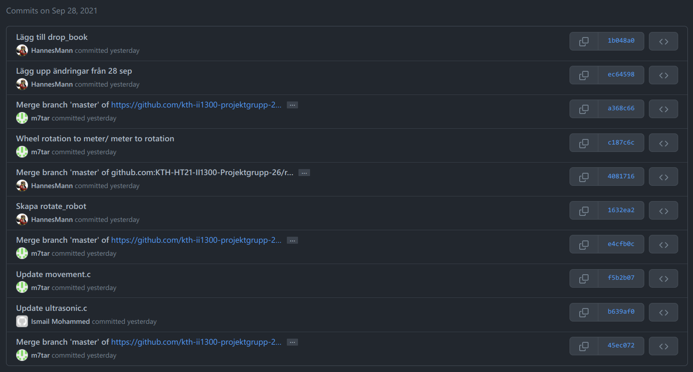

## Huvudprogrammet skapat

Vi är nu inne på den tredje veckan och har kommit igång med själva huvudprogrammet som har uppgiften att leverera post.

För att göra det lättare att arbeta med programmet har vi delat upp den i fyra uppgifter eller "tasks", dessa är:
* **Steg 1:** "Hitta vägg och justera"
* **Steg 2:** "Åk och undvik objekt"
* **Steg 3:** "Släpp av bok"
* **Steg 4:** "Hitta tillbaka till startpunkt"

Steg 1, 2 och 3 måste bli klara innan vecka 4 är över. Det skulle även vara bra om steg 4 skulle bli klart. För steg 2 så är inte heller "undvik objekt" ett "Must" krav då det blir ganska komplicerat men det skulle även vara bra om roboten kunde undvika objekt.

Vid varje steg har vi olika filer och flera funktioner, som till exempel "move_and_avoid.c" och "subtask_find_closest_wall_angle()". Vi har även stödfunktioner för att göra beräkningar lättare och rotera roboten.

*Aktivitet på GitHub under arbetspasset 28 september*

/*video på hur roboten hittar och undviker väggen?*/

2021-09-30 09:15

## Sensorer på LEGO Mindstorms EV3

Det förra inlägget skapades i början av vecka 2, när vi fortfarande behövde forska om sensorerna på LEGO-roboten. Två sensorer följer med LEGO Mindstorms EV3 som är väldigt användbara för projektet, dessa är:

* [EV3 Gyro Sensor](https://www.lego.com/en-se/product/ev3-gyro-sensor-45505) som vi använder för att roboten ska känna av hur mycket den har roterat.
* [EV3 Ultrasonic Sensor](https://www.lego.com/en-se/product/ev3-ultrasonic-sensor-45504) som vi använder för att roboten ska kunna känna av hur långt det är till ett objekt.

När vecka 2 var avslutad så hade vi skapat två testprogram för att se hur sensorerna fungerar och hur dem kan användas med ["brick" library](https://in4lio.github.io/ev3dev-c/group__brick.html) i ev3dev.

*Programmet "gyro.c" som skriver ut vinkel och rotationshastighet i en while-loop*

2021-09-29 22:00

## Hello world!

Vi är en grupp på tre studenter som heter Hannes, Youssef och Ismail. Vi går alla programmet [TIDAB (Högskoleingenjörsutbildning i datateknik)](https://www.kth.se/social/program/tidab/) på KTH och har fått i uppgift att bygga och programmera en LEGO-robot ([LEGO Mindstorms EV3](https://en.wikipedia.org/wiki/Lego_Mindstorms_EV3)) som ska kunna leverera post.

För att programmera roboten använder vi programmeringsspråket C och operativsystemet [ev3dev](https://www.ev3dev.org/).

Vi är nu inne på den andra veckan och ska utforska hur sensorerna kan användas på roboten för att den ska kunna hitta rätt. Tanken är att roboten ska hitta vart den närmaste väggen ligger och sedan åka längs väggen fram till målet.

*EV3 Ultrasonic Sensor, lego.com*

Vecka 1:

Vi byggde ihop roboten och skapade en enkel prototyp i C. Programmet åker framåt, åker bakåt och snurrar runt.

<iframe src="https://streamable.com/e/cjrtjx?autoplay=1&nocontrols=1" frameborder="0" width="100%" height="100%" allowfullscreen allow="autoplay" style="width:100%;height:100%;position:absolute;left:0px;top:0px;overflow:hidden;"></iframe>

*Prototyp från vecka 1*

2021-09-22 14:30